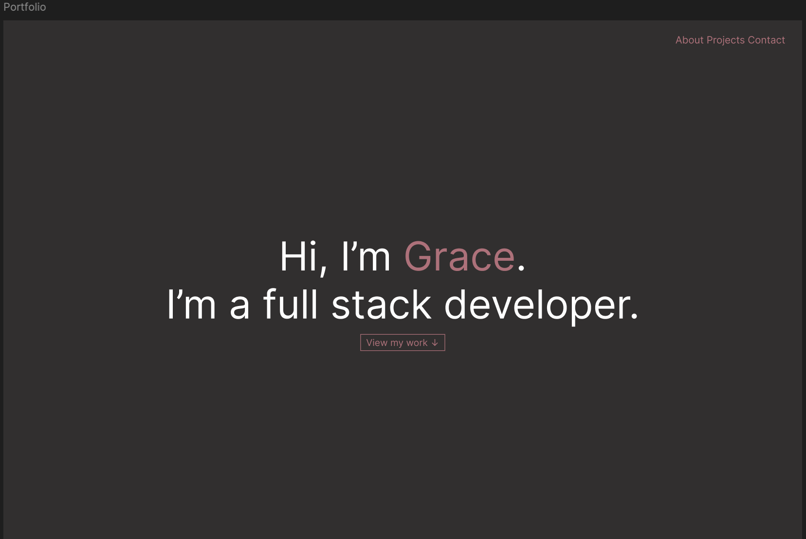

<h1>Personal Portfolio</h1>
<h2>A personal porfolio to display some of the projects I have been working on</h2>

**Link to deployed site:**<a>https://portfolio-bice-sigma-62.vercel.app/</a>

<h2>Overview</h3>
I created this project to practice my design and frontend development skills and to have a place where all of my projects can be displayed in one place.

<h2>Tech Stack</h3>
<ul>
  <li>
    HTML
  </li>
  <li>
    CSS
  </li>
  <li>
    JavaScript
  </li>
    <li>
    Vercel (Deployment)
  </li>
</ul>

<h2>Features</h2>
<ul>
  <li>DOM manipulation to create a traildust effect</li>
  <li>Clean HTML and CSS layout and design</li>
  <li>Designed using Figma</li>
</ul>
<h3>Figma Screenshot of initial high fidelity design:</h3>

<h2>What I learned</h2>
<ul>
  <li>How to use CSS Flexbox to style and position elements</li>
  <li>Learned how to manipulate the DOM to create different effects</li>
  <li>Practiced using Figma for design and building off a design</li>
</ul>

<h2>Future Goals</h2>
<ul>
  <li>Re-build project using React and Typescript</li>
  <li>Add individual project sections to provide more detail on each project</li>
</ul>
